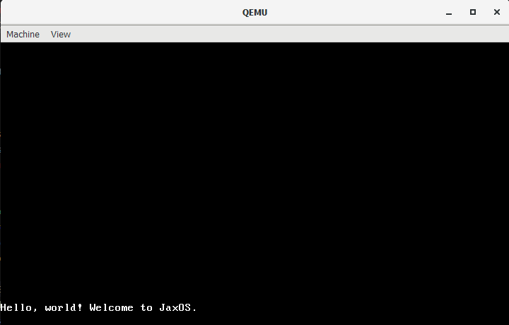

# JaxOS, v0.0.0&emsp;


<br><br />

*Created by Jackson Isenberg*

A kernel built from Rust for a small operating system.


## About

JaxOS is a relatively simplistic operating system for an x86-64 architecture in Rust. It works by running the program through cargo and then onto a bootloader which we emulate through [QEMU](https://www.qemu.org/). The code was created in Visual Studio Code with the use of several plugins made for .toml and .rs files for easier editing.

### Why Rust?

In order to work with only Rust, we need to remove the standard library which relies on already existing abstraction to the computer architecture. Rust is a relatively lower-level language like C but has more safety nets and features to prevent issues from arising (i.e. working with Rust is safer than with C). By using Rust dependencies, we can avoid using ASM. These dependencies were installed by using rustup.

The reason for using Rust is simple: it's like C but better (except in processing speed). Rust also has some of the best [online documentation](https://doc.rust-lang.org/book/title-page.html) out of any language, and its version control is commendable. Note that this project runs on Rust's nightly version.

### Why QEMU?

Upon start-up, a computer executes firmware code in the ROM. This code performs a test, detects available RAM, and pre-initializes the CPU and hardware for the boot. It then looks for a bootable disk to boot the OS kernel.

The JaxOS kernel needs to be turned into a bootable disk image, so it needs to be linked to a bootloader. Instead of creating our own bootloader, which would be a pain, we can just use the bootloader crate. We can run this disk image in the QEMU virtual machine by adding the following lines to our kernel's Cargo.toml (this is information taken from the README of the [bootimage repository](https://github.com/rust-osdev/bootimage)):
```rust
[package.metadata.bootimage]
run-command = ["qemu-system-x86_64", "-drive", "format=raw,file={}"]
```
Then, in our config.toml file under the .cargo folder, we write:
```rust
[target.'cfg(target_os = "none")']
runner = "bootimage runner"
```

Now when you call `cargo run` in the terminal, the virtual machine will be displayed with whatever you are running:
<br><br />


### What's the Purpose?

There is no general purpose for this project other than to experiment with Rust's features outside of the standard library and work with it in a low-level environment.

Basically, this was for fun.


## Testing

JaxOS relies extensively on integrated testing for ensuring that everything is working as intended. In order to run these tests, there is the test_runner crate. However, this does not define the implementation needed for JaxOS's specific tests.

### The `tests` Directory

Integration tests run on their own separate from the [src/main.rs](src/main.rs) file in our kernel. For this, we create a seprate `tests` folder in which we include all of our integrated tests. Each test needs to define its own entry point function.

Since we want to run these tests in a directory seprate from the `src`, we need to create a class that defines the functions needed for said tests.

We can separate tests from regular functions with the `#[cfg(test)]` attribute before the function. Regular functions are attributed with `#[cfg(not(test))]`. In our tests directory, this unnecessary because we are only running tests. Each test case has the attribute `#[test_case]`.

### Creating a Library

The [src/lib.rs](src/lib.rs) file contains the definitions for these integration tests. From this we can always call the specified implementation of panic handling and test running (seen in the test_runner and test_panic functions) through the attribute calls below:
```rust
#![feature(custom_test_frameworks)]
#![test_runner(jax_os::test_runner)]
#![reexport_test_harness_main = "test_main"]
```
This specifies that we are including custom test features in our classfile, a defined test runner as implemented in the library, and the test entry point function `test_main` which is called in the entry point function `_start`.

Defined in this library is also what happens after each test case is run (i.e. the status of the test). This is indicated through exit codes that specify whether the test was a `SUCCESS` or `FAILED`. These exit codes are then defined in a public enum. If all tests pass, then we exit QEMU with the success exit code `0x10`. If at least one test fails, we still want to exit QEMU but with the failed exit code `0x11` and then print the panic info.


## Acknowledgements

This project was inspired by Georgia Tech's Spring 2020 class for CS 3210. You can find the website for that class [here](https://tc.gts3.org/cs3210/2020/spring/lab.html). The tutorial reference that was most useful in creating this project was [Philipp Oppermann's Blog OS](https://os.phil-opp.com/).